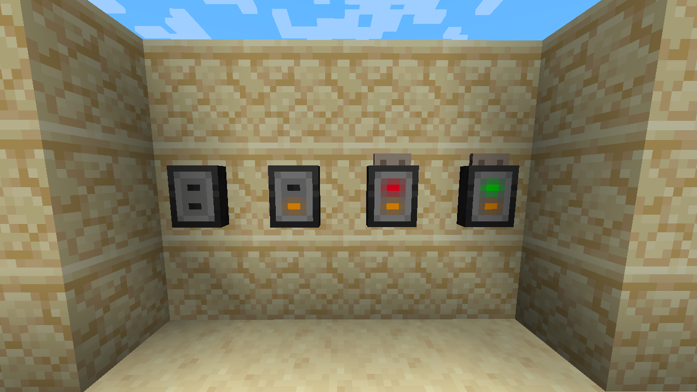
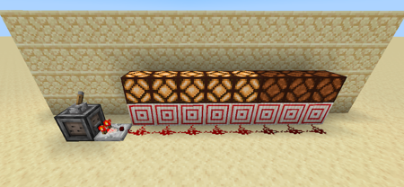

# Paper Punch Cards

My first proper minecraft mod, aimed at adding paper punch cards, and paper tapes tothe game as a mechanism for triggering/controlling redstone signals.

## Punch Cards
Punch cards, used in conjunction with the Card Reader can provide a sort of password protection/ID card. A sequence can be punched into a card, which can be assigned to a card reader. Once set, placing a card with a matching sequence on it into the reader will provide power,this signal will persist until shortly after the player removes the card (can be configured)

Crouch + Right Click whilst holding a punch card to program the reader. Using a blank card will reset the reader.

Right click whilst holding a punch card to place it in the reader.

## Paper Tapes
Paper Tapes are just longer punch cards really. Storing a sequence of data 4 times the size of a punch card (can be configured). Paper tapes can be placed into a Tape Reader which, when powered, will read the paper tape, outputting a redstone signal via comparator matching the sequences strength and durations. Allowing you to coordinate sequences of redstone pulses of varying strength in a small compact manner.

Simply right-click a paper tape into a reader and power it to start playing out the data.

